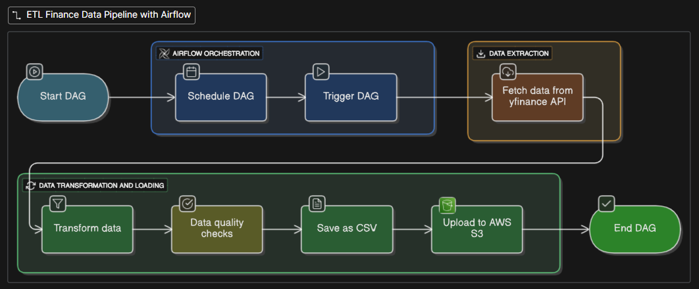
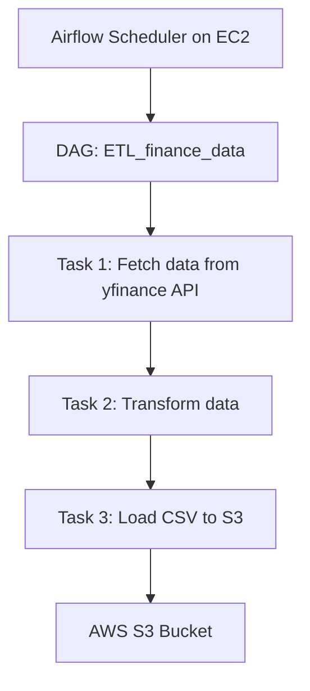

# ETL_finance_data_airflow

{ width=600 height=400 }

[](https://www.python.org/)
[](https://airflow.apache.org/)
[](https://aws.amazon.com/)
[](https://pypi.org/project/yfinance/)

---

## **Project Overview**

**ETL_finance_data_airflow** is an end-to-end **ETL pipeline** built using **Apache Airflow** on an **AWS EC2 instance**. The workflow automatically fetches financial data from the **Yahoo Finance API (yfinance)**, transforms it, and loads it into an **AWS S3 bucket** in CSV format.  

**Key Highlights:**

- Fully automated **Airflow DAG** for scheduling and orchestration  
- Cloud-based storage using **AWS S3** for scalable and persistent data  
- Practical use of **Python, Airflow, and AWS services** for financial data pipelines  
- Modular and reusable design to integrate additional data sources  

---

## **Architecture Diagram**


## Workflow Description

### 1. Extraction
- The DAG starts by fetching financial data from the **yfinance API**.  
- Supports stock prices, market data, and other financial metrics.

### 2. Transformation
- Raw data is cleaned, filtered, and formatted into a tabular structure suitable for analysis.  
- Ensures CSV output is consistent and usable for downstream applications.

### 3. Loading
- Transformed data is uploaded to an **AWS S3 bucket** in CSV format.  
- Uses **AWS SDK (boto3)** to interact with S3 programmatically.

---

## Tools & Technologies

| Tool           | Purpose                                           |
|----------------|-------------------------------------------------- |
| Python         | Core programming for DAGs and ETL scripts         |
| Apache Airflow | Orchestration, scheduling, and DAG management     |
| AWS EC2        | Cloud compute for running Airflow                 |
| AWS S3         | Storage for CSV output files                      |
| yfinance API   | Source for financial market data                  |
| Boto3          | Python SDK for interacting with AWS S3            |

## Airflow Setup Instructions

### 1. Clone the repository

```bash
git clone https://github.com/<username>/ETL_finance_data_airflow.git
cd ETL_finance_data_airflow
```

### 2. Create a virtual environment
```bash
python -m venv airflow_venv
source airflow_venv/bin/activate   # Linux/macOS
airflow_venv\Scripts\activate      # Windows
```

### 3. Install dependencies
```bash
1. sudo yum update -y
2. sudo yum install python3-pip
3. sudo pip install apache-airflow
4. sudo pip install pandas
5. sudo pip install s3fs
6. sudo pip install yfinance
7. sudo pip install boto3
```

## 4. Configure Airflow
```bash
airflow db init
```

###5. Start Airflow Scheduler & Webserver
```bash
airflow scheduler -D
airflow webserver --port 8080 --workers 1
```

